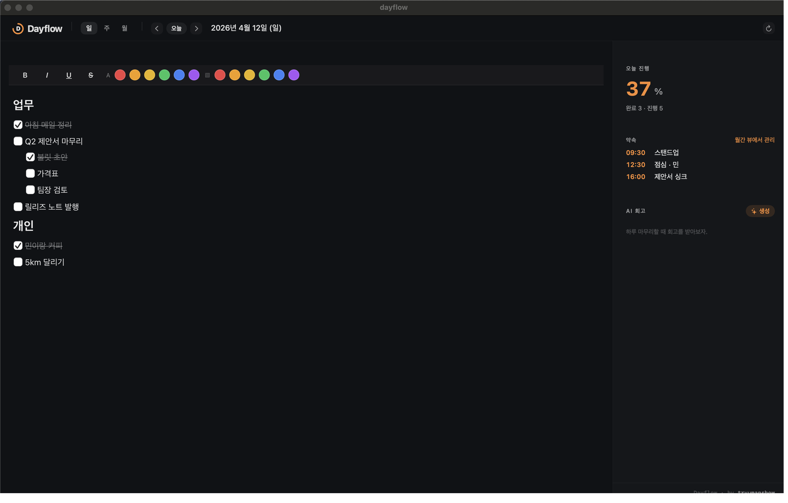
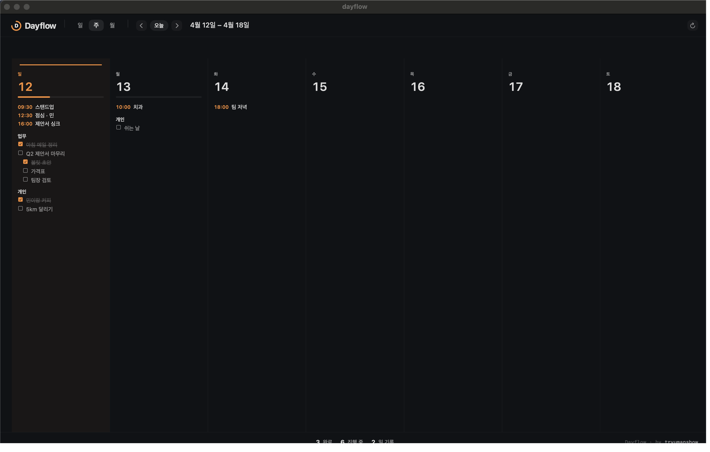
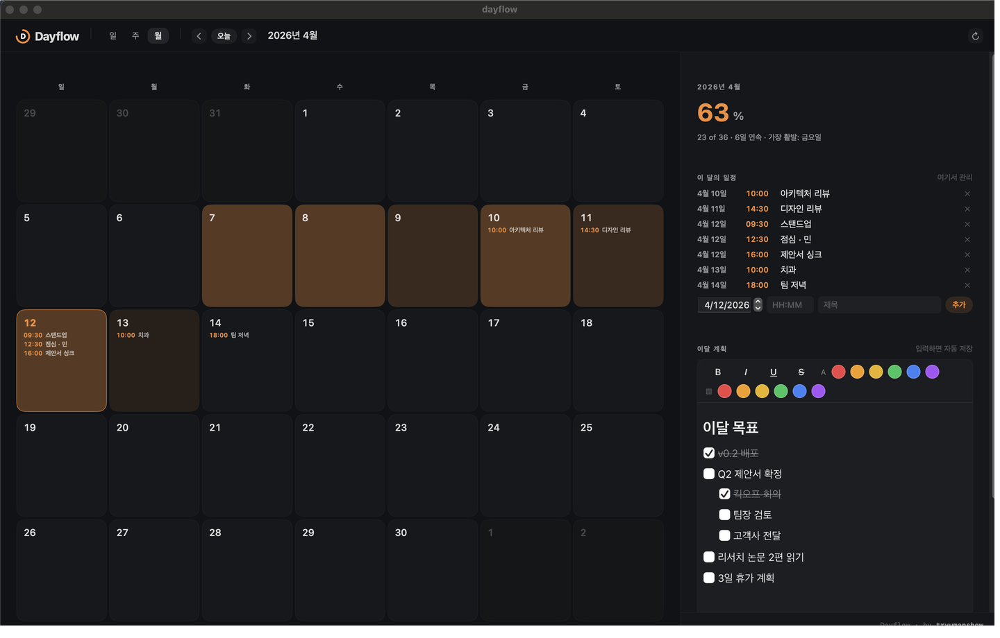
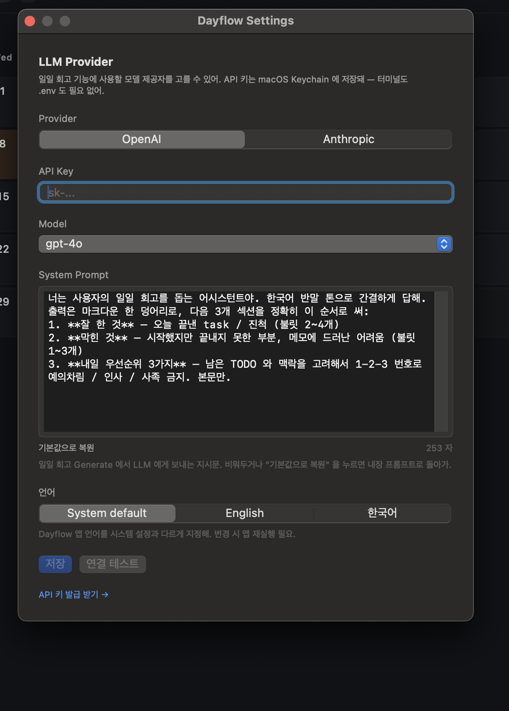

# Dayflow

> 🇺🇸 [English README](README.md)

- 하루 단위 작업 정리와 진행률 추적을 위한 macOS 네이티브 개인 캘린더.
- 단일 사용자 / 로컬 우선 / 의도적으로 작은 앱.
- 메뉴바에 상주하고, 전역 단축키에 반응하며, 원하면 LLM 에게 오늘 하루 회고를 맡길 수 있음.

## 기본 구성

- **3개 뷰** — Day / Week / Month, 모두 하루 하나의 마크다운 본문 위에서 돌아감.
- **블록 기반 WYSIWYG 에디터** — BlockNote 기반, 헤딩·불릿·체크리스트가 입력 즉시 렌더링.
- **리치 텍스트 스타일** — 굵게·기울임·밑줄·취소선 + 텍스트 색 / 배경색을 상단 툴바에서 바로. 마크다운 본문 옆에 무손실 트리를 같이 저장해서 색이랑 밑줄도 재접속 후에 그대로 유지됨.
- **이달 계획** — 월 단위 TODO 전용 에디터. 특정 일자에 얽매이지 않는 한 달짜리 목록을 Month 뷰 오른쪽 레일에서 따로 편집.
- **약속** — 시각이 찍힌 항목 (미팅, 리마인더) 을 전용 `appointments` 테이블에 저장. 세 뷰 모두에 노출: Day 오른쪽 레일의 인라인 추가/삭제, Week 컬럼에서 task 프리뷰 위에 칩 형태, Month 오른쪽 레일에 "이 달의 일정" 목록 (시간순 정렬). Quick Throw (`⌘⇧I`) 에 Task / Appointment 탭 토글이 있어서 어느 쪽이든 다른 앱 떠나지 않고 넣을 수 있음.
- **완전 로컬** — 노트와 회고는 `~/Library/Application Support/Dayflow/`, API 키는 macOS Keychain, 동기화 없음.
- **선택형 LLM 일일 회고** — OpenAI 또는 Anthropic, 제공자 / 모델 / 키 / 프롬프트 모두 앱 안에서 설정.
- **이중 언어 지원** — 영어, 한국어. Settings 에서 전환 가능.

## 화면

### Day 뷰
- 왼쪽은 마크다운 에디터, 오른쪽은 오늘 완료율.
- 체크리스트, 메모, 중첩 목록이 하루 하나의 본문 안에 모두 들어감.
- 상단 툴바: **B** / *I* / <u>U</u> / ~~S~~ + 텍스트/배경 색 스와치. 드래그로 선택 후 버튼 클릭.



### Week 뷰
- 7개 컬럼, 요일별로 하나씩.
- 각 컬럼은 **열린 task 만** 가까운 heading 아래로 그룹지어 미리보기 (최대 heading 2개, heading 당 task 3개). 끝난 일은 컬럼 헤더의 완료율로만 집계되고 프리뷰 자리를 먹지 않음.
- 체크박스는 현장 토글 — 박스를 눌러도 Week 뷰에서 벗어나지 않음.



### Month 뷰
- 일일 활동량에 따라 색이 진해지는 히트맵.
- 오른쪽 레일: 월간 메트릭 (완료율, 최장 연속, 가장 활발한 요일), **이달 계획** 에디터 (월 단위 TODO), "이번 달의 한 줄" (가장 바빴던 날의 첫 실제 라인).



### Settings
- 제공자(OpenAI 또는 Anthropic) 선택.
- API 키 붙여넣기.
- 프리셋 드롭다운에서 모델 선택.
- 일일 회고에 쓸 시스템 프롬프트 편집 (기본값 복원도 가능).
- 앱 언어 영어 / 한국어 전환.



## 요구 사항

- macOS 14.0 이상.

## 빠른 시작 (일반 사용자)

- [최신 릴리즈 페이지](https://github.com/tryumanshow/dayflow/releases/latest) 접속.
- `Dayflow-<버전>.zip` 다운로드.
- 압축 해제하면 `Dayflow.app` 이 나옴.
- `Dayflow.app` 을 `/Applications` 로 드래그.
- 첫 실행 시 "개발자를 확인할 수 없음" Gatekeeper 경고가 뜸 (아직 Apple Developer 계정 없이 ad-hoc 서명만 하고 있음). 우회 방법 2가지:
  - **Finder**: `Dayflow.app` 을 우클릭 → **열기** → 대화상자에서 확인. 한 번만 하면 그 뒤로는 바로 실행됨.
  - **터미널**: `xattr -cr /Applications/Dayflow.app` 실행 후 더블클릭.
- Launchpad 나 Spotlight 에서 실행. 빌드 단계 필요 없음, Xcode 필요 없음.

## 소스 빌드 (개발자)

코드를 수정하거나 아직 릴리즈되지 않은 커밋을 테스트할 때만 필요함.

추가 요구 사항: **Xcode Command Line Tools** (`xcode-select --install`).

```bash
git clone https://github.com/tryumanshow/dayflow
cd dayflow/Dayflow-macOS
./build.sh
```

- 릴리즈 바이너리 빌드.
- `.app` 번들 구성 + 버전 / 빌드 번호 주입.
- `tools/make_icon.py` 로 아이콘 렌더링.
- Ad-hoc 코드사인 + `/Applications/Dayflow.app` 설치.
- CI 가 main 에 머지될 때마다 `macos-14` 러너에서 동일한 `build.sh` 를 돌리기 때문에, 릴리즈 zip 과 로컬 빌드는 (타임스탬프 제외하면) 동일한 `.app` 을 만들어냄.

### 로그인 시 자동 기동 (선택)

```bash
cp Dayflow-macOS/com.swryu.Dayflow.plist ~/Library/LaunchAgents/
launchctl load ~/Library/LaunchAgents/com.swryu.Dayflow.plist
```

- 해제: `launchctl unload ~/Library/LaunchAgents/com.swryu.Dayflow.plist`.

### LLM 제공자 설정 (선택)

- **Dayflow → Settings…** 열기 (또는 `⌘,`).
- **Provider** 선택 — OpenAI 또는 Anthropic. 제공자마다 독립된 Keychain 슬롯 사용.
- **API Key** 붙여넣기. `SecureField` 이며, 이미 저장된 키가 있으면 라벨 아래 힌트가 뜨고 키 필드를 비워둔 채 다른 설정만 업데이트 가능.
- **Model** 을 프리셋 드롭다운에서 선택.
- **System Prompt** 편집 (선택). 내장 기본값은 한국어로 3섹션(잘한 것 / 막힌 것 / 내일 우선순위) 회고를 요청. **기본값으로 복원** 으로 원복 가능.
- **연결 테스트** 로 저장 전에 실제 요청 한 번 쏴서 응답/에러 (URL / status / body snippet 포함) 인라인 확인.
- **저장**.

키 발급 링크:
- OpenAI: https://platform.openai.com/api-keys
- Anthropic: https://console.anthropic.com/settings/keys

### 언어 전환

- Settings → **언어**.
- 옵션: **시스템 기본값** / **English** / **한국어**.
- 변경 시 Dayflow 재실행 필요.

## 사용법

### 기본 조작
- 앱을 실행하면 오늘 날짜의 Day 뷰로 진입.
- 에디터에 그냥 타이핑 — 모든 편집은 debounce 후 자동 저장.
- 상단 `Day` / `Week` / `Month` 탭으로 뷰 전환.
- chevron 으로 단위별(일/주/월) 이동, `Today` 로 오늘 복귀.

### 단축키

| 단축키 | 동작 |
|--------|------|
| `Cmd+N` | Quick Throw 패널 열기 |
| `Cmd+R` | 데이터 새로고침 |
| `Cmd+,` | Preferences 창 |
| `Cmd+Shift+I` | 전역 Quick Throw (Dayflow 가 백그라운드여도 동작) |

### 체크리스트

```markdown
- [ ] 미완료 항목
- [x] 완료 항목
```

- 체크박스 상태는 오른쪽 진행률 패널과 Week / Month 뷰 집계에 즉시 반영.
- Week 뷰에서는 컬럼 안 체크박스를 직접 눌러서 Day 뷰로 이동하지 않고 토글 가능.

## 데이터와 개인정보

- **노트 / 회고 DB** — `~/Library/Application Support/Dayflow/dayflow.db` (SQLite, WAL 모드). 스키마는 `day_notes` + `reviews` 두 테이블뿐이며, 나머지는 전부 마크다운 본문 안에 들어감.
- **API 키** — macOS **Keychain**. 평문 파일 / 환경변수 / 로그 어디에도 기록되지 않음.
- **Provider / 모델 / 커스텀 시스템 프롬프트 / 언어 override** — `UserDefaults` (역시 로컬만).
- **외부로 나가는 트래픽** — 일일 회고 패널에서 **Generate** 버튼을 누른 시점에만. HTTPS 요청 1건이 네가 선택한 제공자로 나가고, 본문에는 날짜 문자열(`yyyy-MM-dd`) / 해당 날의 원본 마크다운 / 현재 시스템 프롬프트 세 가지만 포함. 다른 날 데이터, 장치 식별자, 텔레메트리, 크래시 리포트 전부 없음.
- **백업** — `~/Library/Application Support/Dayflow/` 디렉토리 전체를 복사해두면 끝. DB 본체와 WAL / SHM 파일 세트로.

---

- 개발 / 기여 관련 정보: [CONTRIBUTING.md](CONTRIBUTING.md).
