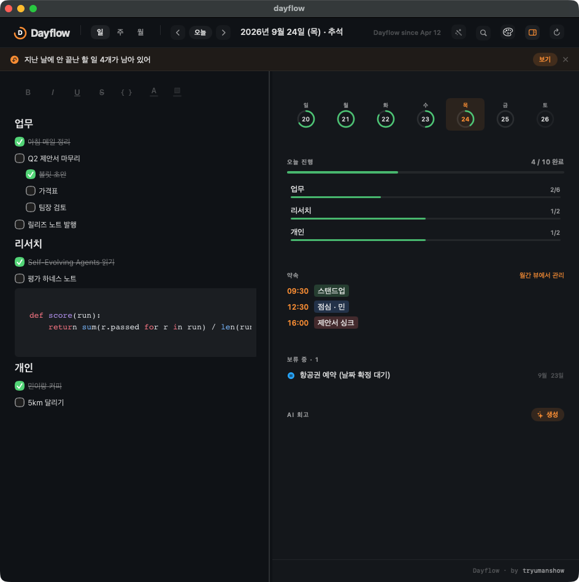
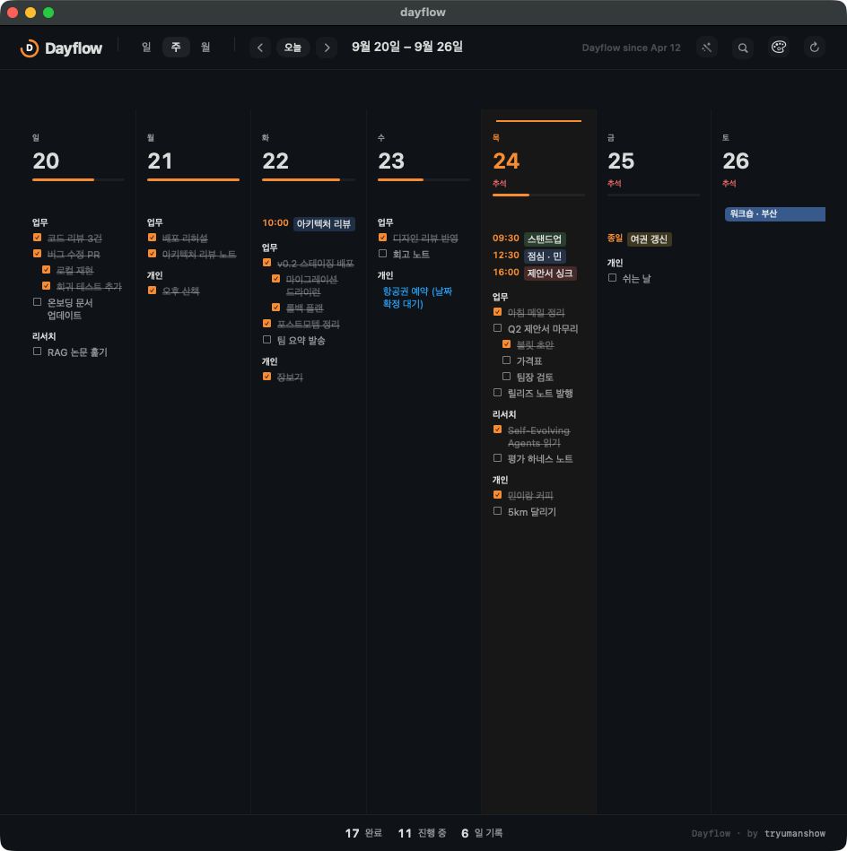
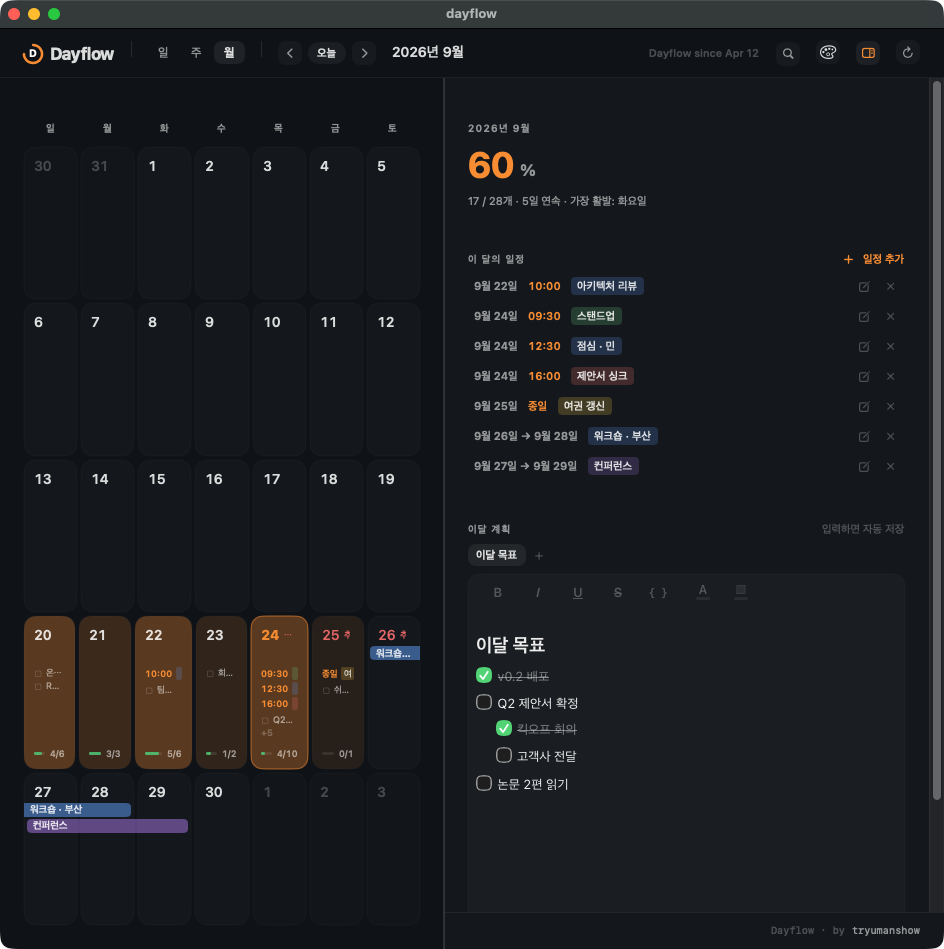
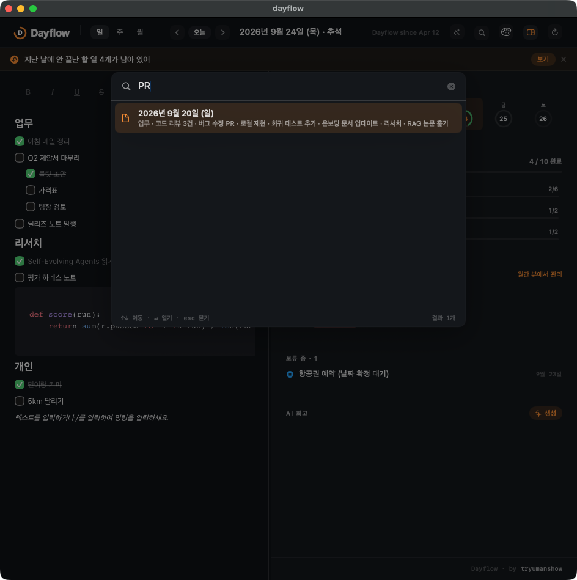
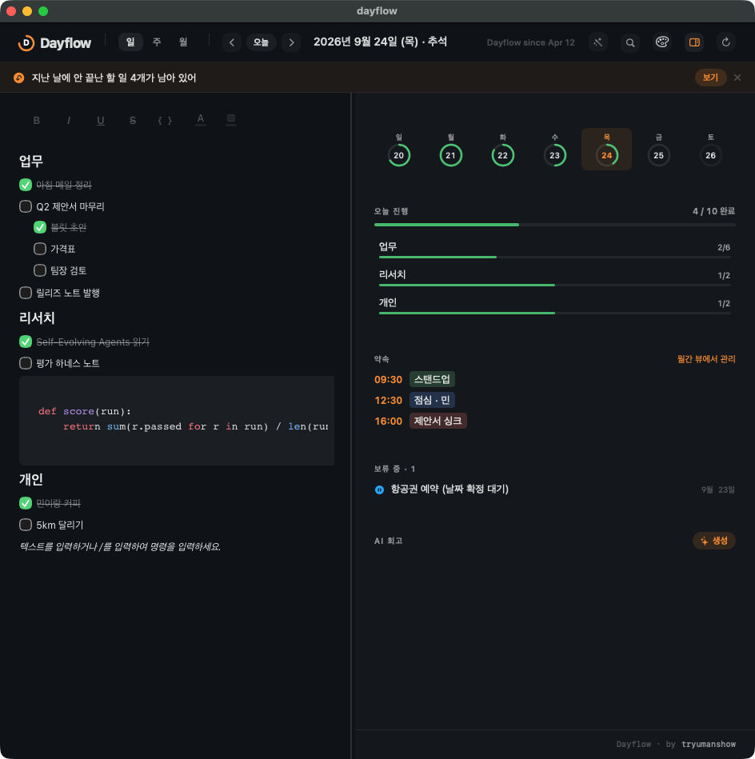
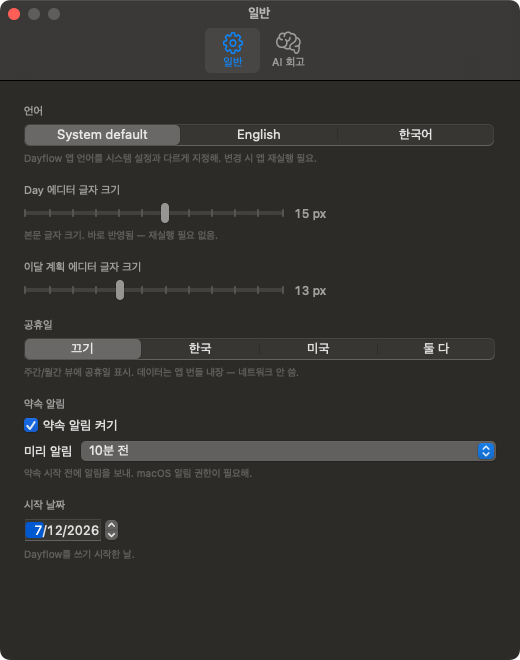

# Dayflow

> 🇺🇸 [English README](README.md)

- 하루 단위 작업 정리와 진행률 추적을 위한 macOS 네이티브 개인 캘린더.
- 단일 사용자 / 로컬 우선 / 의도적으로 작은 앱.
- 메뉴바에 상주하고, 전역 단축키에 반응하며, 원하면 LLM 에게 오늘 하루 회고를 맡길 수 있음.

## 왜 만들었나

Obsidian 은 업무용으로 쓴다 — 프로젝트 노트, 레퍼런스, 회사가 바뀌어도 남아야 하는 것들. 그런데 하루의 나머지 절반, 그러니까 "오늘 뭐 하기로 했지", "지난주에 안 끝낸 건 뭐지", "그 약속 언제였지" 를 둘 자리가 없었다. Dayflow 가 그 절반이다. 내가 쓰려고 만들었고, 지금도 매일 아침 연다.

## 기본 구성

- **3개 뷰** — Day / Week / Month, 모두 하루 하나의 마크다운 본문 위에서 돌아감.
- **블록 기반 WYSIWYG 에디터** — BlockNote 기반, 헤딩·불릿·체크리스트가 입력 즉시 렌더링.
- **리치 텍스트 스타일** — 굵게·기울임·밑줄·취소선·인라인 코드 + 텍스트 색 / 배경색을 상단 툴바에서 바로. 마크다운 본문 옆에 무손실 트리를 같이 저장해서 색이랑 밑줄도 재접속 후에 그대로 유지됨.
- **코드 블럭** — 빈 줄에서 `` ``` `` + Space, 또는 슬래시 메뉴에서 "Code Block" 선택. 모노스페이스 다크 테마, 마크다운 펜스 구문 그대로 왕복.
- **표** — 슬래시 메뉴에서 "Table" 선택 후 Notion 스타일 그리드 피커로 크기 지정 (최대 6 × 6). 빈 셀에서 Backspace 누르면 표 전체 삭제.
- **이달 계획** — 월 단위 TODO 전용 에디터. 특정 일자에 얽매이지 않는 한 달짜리 목록을 Month 뷰 오른쪽 레일에서 따로 편집.
- **약속** — 시각이 찍힌 항목 (미팅, 리마인더) 을 전용 `appointments` 테이블에 저장. 세 뷰 모두에 노출: Day 오른쪽 레일에 읽기 전용 목록, Week 컬럼에서 task 프리뷰 위에 칩 형태, Month 오른쪽 레일에 "이 달의 일정" 목록 (시간순 정렬) — 등록과 수정은 Month 에서만. Quick Throw (`⌘⇧I`) 에 Task / Appointment 탭 토글이 있어서 어느 쪽이든 다른 앱 떠나지 않고 넣을 수 있음.
- **이미지** — 노트에 그림을 바로 붙여넣거나 끌어다 놓을 수 있음. 파일은 `~/Library/Application Support/Dayflow/attachments/` 로 복사되고 본문에는 참조만 남으므로, 재시작 후에도 살아있으면서 DB 를 불리지 않음. 웹 페이지에서 복사한 이미지도 남의 서버 링크가 아니라 그림 자체를 저장함.
- **전역 검색** (`⌘⇧F`) — 모든 Day 노트 / 약속 / 이달 계획 섹션을 한 팔레트에서 검색. 단어가 아니라 부분 문자열로 매칭해서 `산` 으로 `부산` 도 잡힘. `↑`/`↓` 이동, `↵` 으로 해당 항목이 사는 뷰로 바로 점프.
- **할 일 이월** — 지난 7일 안에 체크 안 하고 넘어간 할 일이 있으면 오늘 상단에 배너로 뜸. 목록 확인 후 아직 유효한 것만 고르면 그 항목들이 **이동** 함 — 오늘 노트에 추가되고 원래 날짜에서는 사라져서, 같은 일이 두 번 세어지지 않음.
- **약속 알림** — macOS 알림으로 약속 시작 0 / 5 / 10 / 30 / 60분 전에 알려줌. 직접 켜기 전까지는 꺼져 있음.
- **Google 캘린더 가져오기** — 선택 기능, **읽기 전용**. 구글 일정을 Dayflow 약속으로 미러링해서 모든 뷰에 띄움. 구글 쪽으로 되돌려 쓰는 일은 절대 없음.
- **로컬 우선** — 노트와 회고는 `~/Library/Application Support/Dayflow/`, API 키는 macOS Keychain. 네가 요청하지 않으면 아무것도 밖으로 안 나감. 서버와 통신하는 건 딱 둘 — Generate 를 눌렀을 때의 LLM 회고, 그리고 (연결했다면) Google 캘린더 가져오기.
- **선택형 LLM 일일 회고** — OpenAI 또는 Anthropic, 제공자 / 모델 / 키 / 프롬프트 모두 앱 안에서 설정.
- **이중 언어 지원** — 영어, 한국어. Settings 에서 전환 가능.

## 화면

### Day 뷰
- 왼쪽은 마크다운 에디터. 오른쪽엔 오늘 완료율, 그날의 약속, AI 회고 패널.
- 체크리스트, 메모, 중첩 목록이 하루 하나의 본문 안에 모두 들어감.
- 지난 날에 안 끝낸 할 일이 남아 있으면 상단에 배너가 뜸 — [할 일 이월](#할-일-이월) 참고.
- 상단 툴바: **B** / *I* / <u>U</u> / ~~S~~ / `{ }` + 글자색 / 형광펜. 드래그로 선택 후 버튼 클릭. 색 스와치는 두 버튼 뒤에 접혀 있고, 각 버튼 밑줄이 지금 선택에 적용된 색을 보여줌.
- 슬래시 메뉴 (빈 줄에서 `/`): 헤딩, 목록, 코드 블럭, 표 등.



### Week 뷰
- 7개 컬럼, 요일별로 하나씩. 각 컬럼에 그날의 약속이 칩으로 먼저, 그 아래 열린 task.
- task 프리뷰는 **열린 것만** 가까운 heading 아래로 그룹지어 보여줌 (최대 heading 2개, heading 당 task 3개). 끝난 일은 컬럼 헤더의 완료율로만 집계되고 프리뷰 자리를 먹지 않음.
- 체크박스는 현장 토글 — 박스를 눌러도 Week 뷰에서 벗어나지 않음.



### Month 뷰
- 일일 활동량에 따라 색이 진해지는 히트맵.
- 오른쪽 레일 위에서부터: 월간 메트릭 (완료율, 최장 연속, 가장 활발한 요일), 이 달의 일정 전체, **이달 계획** 에디터 (월 단위 TODO).
- 일정 등록은 Month 뷰에서 함. 추가 폼은 **일정 추가** 버튼 뒤에 접혀 있음 — 레일보다 넓기도 하고, 일정 등록은 늘 하는 일이 아니니까. 각 줄의 연필을 누르면 그 일정이 채워진 채로 열림.



### 전역 검색 (`⌘⇧F`)
- Day 노트 / 약속 / 이달 계획 섹션을 한 번에 훑는 팔레트. 각 줄 왼쪽 아이콘으로 종류 구분.
- 단어 단위가 아니라 부분 문자열 매칭이라 `산` 을 치면 `부산` 이 걸림. (SQLite FTS5 대신 `LIKE` 를 쓰는 이유가 이거다 — `unicode61` 토크나이저가 한글 덩어리를 토큰 하나로 잡아서, 부분 검색이 아무것도 못 찾는다.)
- `↑`/`↓` 로 이동, `↵` 로 열기. 열면 그 항목이 사는 뷰로 전환됨 — 노트는 Day, 약속은 Week, 계획 섹션은 Month — 날짜까지 맞춰서.



### 할 일 이월
- 지난 7일 안에 체크 안 된 할 일이 남아 있으면 오늘 상단에 배너가 뜸.
- 같은 문구가 여러 날에 걸쳐 열려 있으면 한 줄로 합쳐지고, 이미 오늘 노트에 적혀 있는 건 제외됨.
- 확정하면 할 일이 **이동** 함 — 오늘 노트 아래에 붙고, 원래 날짜에서는 지워짐. 시트를 열어둔 사이에 원본 날짜가 바뀌었다면 그 줄은 건드리지 않고 건너뜀.



### Settings
- **일반** — *표시* (앱 언어, 에디터 글자 크기, 공휴일 표시 — 한국 / 미국 / 둘 다, 앱에 내장되어 네트워크 안 씀), *알림* (약속 알림과 미리 알림 시각), *데이터* (Dayflow 를 쓰기 시작한 날짜) 로 묶여 있음.
- **캘린더** — Google 캘린더 연결 + 가져올 캘린더 선택. 읽기 전용. 아래 [Google 캘린더](#google-캘린더-선택-읽기-전용) 참고.
- **AI 회고** — 제공자 (OpenAI 또는 Anthropic), API 키, 모델, 일일 회고를 굴리는 시스템 프롬프트.



## 요구 사항

- macOS 14.0 이상.

## 빠른 시작 (일반 사용자)

- [최신 릴리즈 페이지](https://github.com/tryumanshow/dayflow/releases/latest) 접속.
- `Dayflow-<버전>.zip` 다운로드.
- 압축 해제하면 `Dayflow.app` 이 나옴.
- `Dayflow.app` 을 `/Applications` 로 드래그.
- 첫 실행 시 "개발자를 확인할 수 없음" Gatekeeper 경고가 뜸 (아직 Apple Developer 계정 없이 ad-hoc 서명만 하고 있음). 우회 방법 2가지:
  - **Finder**: `Dayflow.app` 을 우클릭 → **열기** → 대화상자에서 확인. 한 번만 하면 그 뒤로는 바로 실행됨.
  - **터미널**: `xattr -cr /Applications/Dayflow.app` 실행 후 더블클릭.
- Launchpad 나 Spotlight 에서 실행. 빌드 단계 필요 없음, Xcode 필요 없음.

## 소스 빌드 (개발자)

코드를 수정하거나 아직 릴리즈되지 않은 커밋을 테스트할 때만 필요함.

추가 요구 사항: **Xcode Command Line Tools** (`xcode-select --install`).

```bash
git clone https://github.com/tryumanshow/dayflow
cd dayflow/Dayflow-macOS
./build.sh
```

- 릴리즈 바이너리 빌드.
- `.app` 번들 구성 + 버전 / 빌드 번호 주입.
- `tools/make_icon.py` 로 아이콘 렌더링.
- Ad-hoc 코드사인 + `/Applications/Dayflow.app` 설치.
- CI 가 main 에 머지될 때마다 `macos-14` 러너에서 동일한 `build.sh` 를 돌리기 때문에, 릴리즈 zip 과 로컬 빌드는 (타임스탬프 제외하면) 동일한 `.app` 을 만들어냄.

### 빠른 재빌드 & 재시작 (개발용)

```bash
cd dayflow/Dayflow-macOS && swift build \
  && killall DayflowApp \
  ; cp .build/debug/DayflowApp /Applications/Dayflow.app/Contents/MacOS/DayflowApp \
  && open /Applications/Dayflow.app
```

### 로그인 시 자동 기동 (선택)

```bash
cp Dayflow-macOS/com.swryu.Dayflow.plist ~/Library/LaunchAgents/
launchctl load ~/Library/LaunchAgents/com.swryu.Dayflow.plist
```

- 해제: `launchctl unload ~/Library/LaunchAgents/com.swryu.Dayflow.plist`.

### LLM 제공자 설정 (선택)

- **Dayflow → Settings…** 열기 (또는 `⌘,`).
- **Provider** 선택 — OpenAI 또는 Anthropic. 제공자마다 독립된 Keychain 슬롯 사용.
- **API Key** 붙여넣기. `SecureField` 이며, 이미 저장된 키가 있으면 라벨 아래 힌트가 뜨고 키 필드를 비워둔 채 다른 설정만 업데이트 가능.
- **Model** 을 프리셋 드롭다운에서 선택.
- **System Prompt** 편집 (선택). 내장 기본값은 한국어로 3섹션(잘한 것 / 막힌 것 / 내일 우선순위) 회고를 요청. **기본값으로 복원** 으로 원복 가능.
- **연결 테스트** 로 저장 전에 실제 요청 한 번 쏴서 응답/에러 (URL / status / body snippet 포함) 인라인 확인.
- **저장**.

키 발급 링크:
- OpenAI: https://platform.openai.com/api-keys
- Anthropic: https://console.anthropic.com/settings/keys

### 언어 전환

- Settings → **언어**.
- 옵션: **시스템 기본값** / **English** / **한국어**.
- 변경 시 Dayflow 재실행 필요.

## 사용법

### 기본 조작
- 앱을 실행하면 오늘 날짜의 Day 뷰로 진입.
- 에디터에 그냥 타이핑 — 모든 편집은 debounce 후 자동 저장.
- 상단 `Day` / `Week` / `Month` 탭으로 뷰 전환.
- chevron 으로 단위별(일/주/월) 이동, `Today` 로 오늘 복귀.

### 단축키

| 단축키 | 동작 |
|--------|------|
| `Cmd+N` | Quick Throw 패널 열기 |
| `Cmd+Shift+I` | 전역 Quick Throw (Dayflow 가 백그라운드여도 동작) |
| `Cmd+Shift+F` | 노트 / 약속 / 이달 계획 전역 검색 |
| `Cmd+F` | 현재 에디터 안에서 찾기 |
| `Cmd+←` / `Cmd+→` | 이전 / 다음 — 지금 보고 있는 뷰에 맞춰 일·주·월 단위로 이동 |
| `Cmd+T` | 오늘로 복귀 |
| `Cmd+Option+S` | 사이드 레일 접기 / 펴기 |
| `Cmd+=` / `Cmd+-` / `Cmd+0` | 에디터 확대 / 축소 / 기본값 |
| `Cmd+R` | 데이터 새로고침 |
| `Cmd+,` | 설정 |

### 체크리스트

```markdown
- [ ] 미완료 항목
- [x] 완료 항목
```

- 체크박스 상태는 오른쪽 진행률 패널과 Week / Month 뷰 집계에 즉시 반영.
- Week 뷰에서는 컬럼 안 체크박스를 직접 눌러서 Day 뷰로 이동하지 않고 토글 가능.

### 약속 알림

- Settings → **일반** → **약속 알림 켜기**. 처음 켤 때 macOS 가 알림 권한을 물어봄.
- 언제 알려줄지 선택: 시작 시각, 또는 5 / 10 / 30 / 60분 전.
- 약속이 바뀔 때마다 예약을 통째로 다시 잡기 때문에 수정 / 삭제가 바로 반영됨.
- macOS 가 앱당 대기 중인 로컬 알림 개수를 제한하므로, 가장 가까운 60건만 예약하고 하나씩 발사될 때마다 다시 채움.
- 종일 일정은 알림을 안 보냄 — 자정 시작은 저장 방식일 뿐 실제로 뭔가 일어나는 시각이 아니니까.

### Google 캘린더 (선택, 읽기 전용)

가져오기만 함. Dayflow 는 캘린더를 읽기만 하고 쓰지 않아 — 가져온 일정은 앱에서 수정/삭제가 막혀 있는데, 어차피 다음 동기화 때 그대로 되돌아오기 때문이야.

**OAuth 클라이언트는 본인 것을 쓴다.** Dayflow 는 구글 자격증명을 넣어 배포하지 않아. 오픈소스 바이너리 안의 OAuth 클라이언트 ID 는 비밀로 유지할 수 없고 (`strings` 로 그냥 뽑힘), API 할당량과 동의 화면도 클라이언트 소유자에게 붙어. 그래서 LLM API 키와 같은 방식 — 네 자격증명, 네 Keychain.

1. [Google Cloud Console](https://console.cloud.google.com/apis/credentials) 에서 프로젝트 생성.
2. **API 및 서비스** → **Google Calendar API** 사용 설정.
3. **사용자 인증 정보** → **사용자 인증 정보 만들기** → **OAuth 클라이언트 ID** → 애플리케이션 유형 **데스크톱 앱**.
4. **클라이언트 ID** 와 **클라이언트 보안 비밀번호** 를 Dayflow 의 Settings → **캘린더** 에 붙여넣기.
5. **Google 캘린더 연결** 클릭. 브라우저에 구글 동의 화면이 뜨고, 승인하면 탭이 앱으로 돌아가라고 알려줌.

웹서버도, 도메인도, **nginx 도 필요 없어.** 구글의 installed-app 플로우는 데스크탑 클라이언트가 `http://127.0.0.1` 의 임의 포트로 리디렉트하는 걸 허용해. 그래서 Dayflow 는 동의 화면이 떠 있는 몇 초 동안만 소켓을 열어서, 브라우저가 딱 한 번 보내는 요청에서 authorization code 를 읽고 닫아. 교환은 PKCE 로 보호되고, refresh token 은 macOS Keychain 에 들어가.

연결 후:

- 가져올 캘린더 체크. 아무것도 체크 안 하면 기본 캘린더만.
- 앱 실행 시, 30분마다, 그리고 **지금 동기화** 를 누를 때 동기화.
- 미러링 범위는 30일 전 ~ 180일 후.
- 가져온 항목엔 작은 **ⓖ** 표시가 붙고 수정/삭제 버튼이 없음.
- **연결 해제** 하면 권한을 잊고 가져온 일정을 전부 지움. 직접 적은 약속은 그대로 남음.
- 요청 스코프는 `calendar.readonly` — 뭔가 쓰기를 시도하더라도 구글이 권한 자체를 안 줌.

## 데이터와 개인정보

- **DB** — `~/Library/Application Support/Dayflow/dayflow.db` (SQLite, WAL 모드). 테이블은 `day_notes` / `reviews` / `appointments` / `month_plan_sections` (+ 편집 히스토리). Day 노트가 담는 것들은 전부 마크다운 본문 안에 들어감.
- **API 키와 Google refresh token** — macOS **Keychain**. 평문 파일 / 환경변수 / 로그 어디에도 기록되지 않음.
- **Provider / 모델 / 커스텀 시스템 프롬프트 / 언어 override / 알림 설정 / Google 클라이언트 ID** — `UserDefaults` (역시 로컬만).
- **외부로 나가는 트래픽** — 네가 켠 경우에만, 딱 두 가지:
  - **LLM 회고**: **Generate** 를 누른 시점에 HTTPS 요청 1건. 본문에는 날짜 문자열(`yyyy-MM-dd`) / 해당 날의 원본 마크다운 / 현재 시스템 프롬프트만 포함.
  - **Google 캘린더**: 연결한 경우, `calendar.readonly` 로 일정을 **읽어옴**. 네 노트는 이 요청에 안 들어가 — 업로드가 아니라 다운로드야.
- 다른 날 데이터, 장치 식별자, 텔레메트리, 크래시 리포트는 전부 없음.
- **백업** — `~/Library/Application Support/Dayflow/` 디렉토리 전체를 복사해두면 끝. DB 본체와 WAL / SHM 파일 세트로.

---

- 개발 / 기여 관련 정보: [CONTRIBUTING.md](CONTRIBUTING.md).
