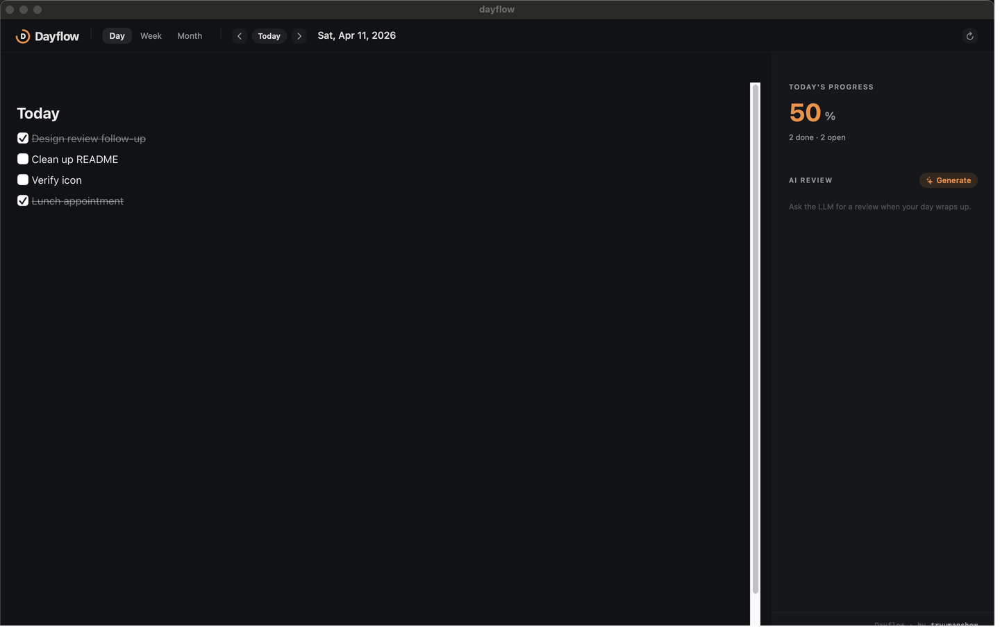
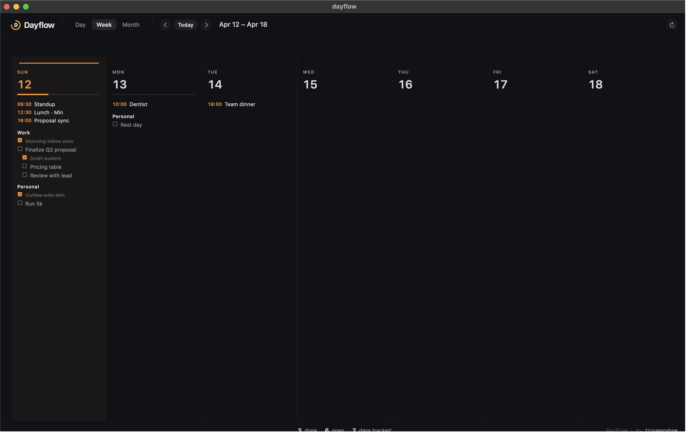
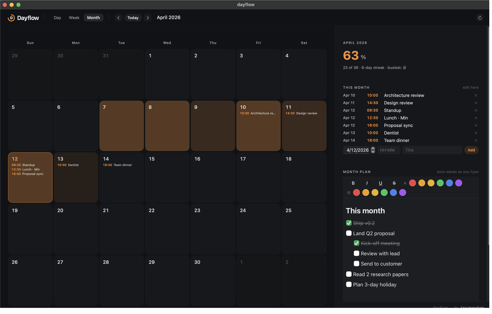
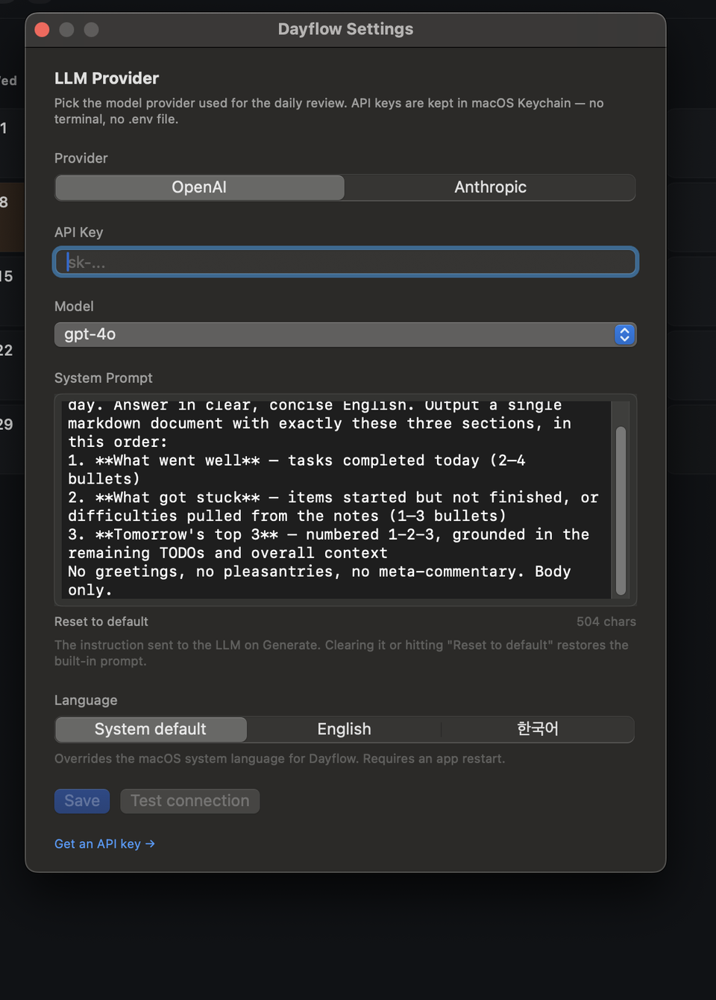

# Dayflow

> 🇰🇷 [한국어 README](README.ko.md)

- A native macOS calendar for personal daily planning and progress tracking.
- Single-user, local-first, intentionally small.
- Lives in the menu bar, responds to a global hotkey, and can optionally ask an LLM to write a daily review.

## What you get

- **Three views** — Day / Week / Month, all backed by one markdown body per day.
- **Block-based WYSIWYG editor** — powered by BlockNote, with live rendering of headings, bullets, and checklists.
- **Rich text styling** — bold, italic, underline, strikethrough, plus text and background color from a top toolbar. Full fidelity is stored alongside the markdown body so colors and underlines survive across reloads.
- **Local-only by design** — notes and reviews live in `~/Library/Application Support/Dayflow/`, API keys live in macOS Keychain, nothing is synced.
- **Optional LLM daily review** — OpenAI or Anthropic, picked and configured entirely inside the app.
- **Bilingual** — English or Korean, switchable in Settings, no relaunch-from-terminal needed.

## Screenshots

### Day view
- Markdown editor on the left, today's completion ratio on the right.
- Checklists, memos, and nested lists all live in one body per day.
- Top toolbar: **B** / *I* / <u>U</u> / ~~S~~, plus text and background color swatches. Select text, click a button.



### Week view
- Seven columns, one per weekday.
- Each column shows a compact preview of that day's headings and tasks.
- Checkboxes are tappable in place — toggling a box does not navigate away from the week.



### Month view
- Heatmap colored by how much you actually did each day.
- Rolling stats in the right rail: completed count, longest streak, busiest weekday.
- "Line of the month" surfaces the first real line from your highest-activity day.



### Settings
- Pick a provider (OpenAI or Anthropic).
- Paste an API key.
- Pick a model from the preset dropdown.
- Edit the system prompt that drives the daily review (or reset to default).
- Switch the app language between English and Korean.



## Requirements

- macOS 14.0 or later.

## Quickstart (users)

- Head to the [latest release](https://github.com/tryumanshow/dayflow/releases/latest).
- Download `Dayflow-<version>.zip`.
- Unzip — you get `Dayflow.app`.
- Drag `Dayflow.app` into `/Applications`.
- First launch will show a "cannot verify developer" warning because the release is ad-hoc signed (no paid Apple Developer account yet). Two ways around it:
  - **Finder**: right-click `Dayflow.app` → **Open** → confirm in the dialog. Once, then it's trusted forever.
  - **Terminal**: `xattr -cr /Applications/Dayflow.app` then double-click as usual.
- Launch from Launchpad or Spotlight. That's it — no build step, no Xcode required.

## Build from source (developers)

Only needed if you want to modify the code or test an unreleased commit.

Extra requirement: **Xcode Command Line Tools** (`xcode-select --install`).

```bash
git clone https://github.com/tryumanshow/dayflow
cd dayflow/Dayflow-macOS
./build.sh
```

- Builds the release binary.
- Assembles the `.app` bundle with version and build number injected.
- Renders the app icon from `tools/make_icon.py`.
- Ad-hoc signs and installs to `/Applications/Dayflow.app`.
- CI runs the exact same `build.sh` on a `macos-14` runner for every merge to `main`, so the release zip and your local build produce bit-for-bit the same `.app` (modulo timestamps).

### Launch at login (optional)

```bash
cp Dayflow-macOS/com.swryu.Dayflow.plist ~/Library/LaunchAgents/
launchctl load ~/Library/LaunchAgents/com.swryu.Dayflow.plist
```

- Undo with `launchctl unload ~/Library/LaunchAgents/com.swryu.Dayflow.plist`.

### Configure an LLM provider (optional)

- Open **Dayflow → Settings…** (or press `⌘,`).
- Pick a **Provider** — OpenAI or Anthropic. Each provider has its own independent Keychain slot.
- Paste an **API Key**. The field is a `SecureField`; if a key is already saved you'll see a hint and can leave the field blank while editing other fields.
- Pick a **Model** from the provider's preset dropdown.
- Optionally rewrite the **System Prompt**. The built-in default asks for a three-section review (what went well / what got stuck / tomorrow's top 3). Hit **Reset to default** to go back.
- Click **Test connection** to fire a real request with the current settings. Any error (URL, status code, body snippet) is surfaced inline.
- Click **Save**.

Key issue pages:
- OpenAI: https://platform.openai.com/api-keys
- Anthropic: https://console.anthropic.com/settings/keys

### Switch language

- Settings → **Language**.
- Options: **System default**, **English**, **한국어**.
- Requires a relaunch of Dayflow for the override to take effect.

## Usage

### Basic navigation
- Launching the app drops you into today's Day view.
- Type directly in the editor — everything persists automatically (debounced).
- Switch views via the `Day` / `Week` / `Month` tabs at the top.
- Step through dates with the chevron buttons; jump back to the current day with `Today`.

### Keyboard shortcuts

| Shortcut | Action |
|----------|--------|
| `Cmd+N` | Open Quick Throw |
| `Cmd+R` | Refresh data |
| `Cmd+,` | Preferences window |
| `Cmd+Shift+I` | Global Quick Throw (works even when Dayflow is in the background) |

### Checklists

```markdown
- [ ] open item
- [x] done item
```

- Checkbox state is reflected immediately in the right-hand progress panel and the Week / Month view aggregates.
- In the Week view, tap a checkbox directly inside its column to toggle without navigating into the Day view.

## Data and privacy

- **Notes and reviews database** — `~/Library/Application Support/Dayflow/dayflow.db` (SQLite, WAL mode). Schema is just `day_notes` + `reviews`; everything else rides inside the markdown body.
- **API keys** — macOS **Keychain**. Never written to plain files, environment variables, or logs.
- **Provider / model / custom system prompt / language override** — `UserDefaults` (also local-only).
- **Outbound traffic** — only when you press **Generate** on the daily review panel. One HTTPS request per press, sent to the provider you picked. Body contains: the date string (`yyyy-MM-dd`), that day's raw markdown, and the current system prompt. Nothing else is ever sent — no other day's data, no device identifier, no telemetry, no crash reports.
- **Backup** — copy `~/Library/Application Support/Dayflow/` somewhere safe. The DB plus its WAL and SHM files are all that matter.

---

- Development and contribution info: [CONTRIBUTING.md](CONTRIBUTING.md).
