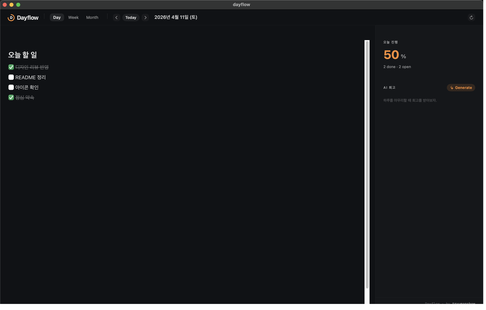
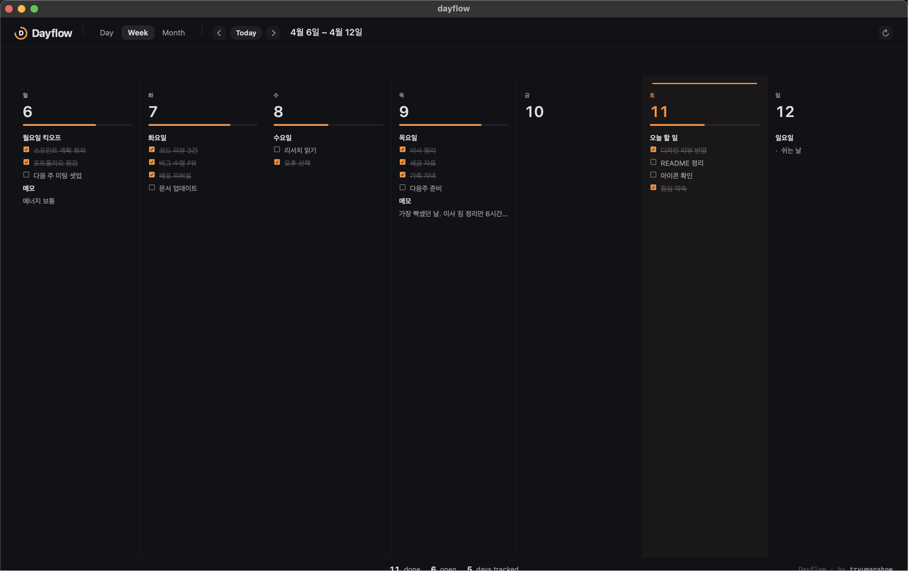
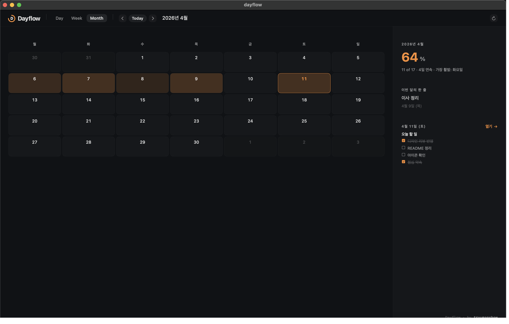
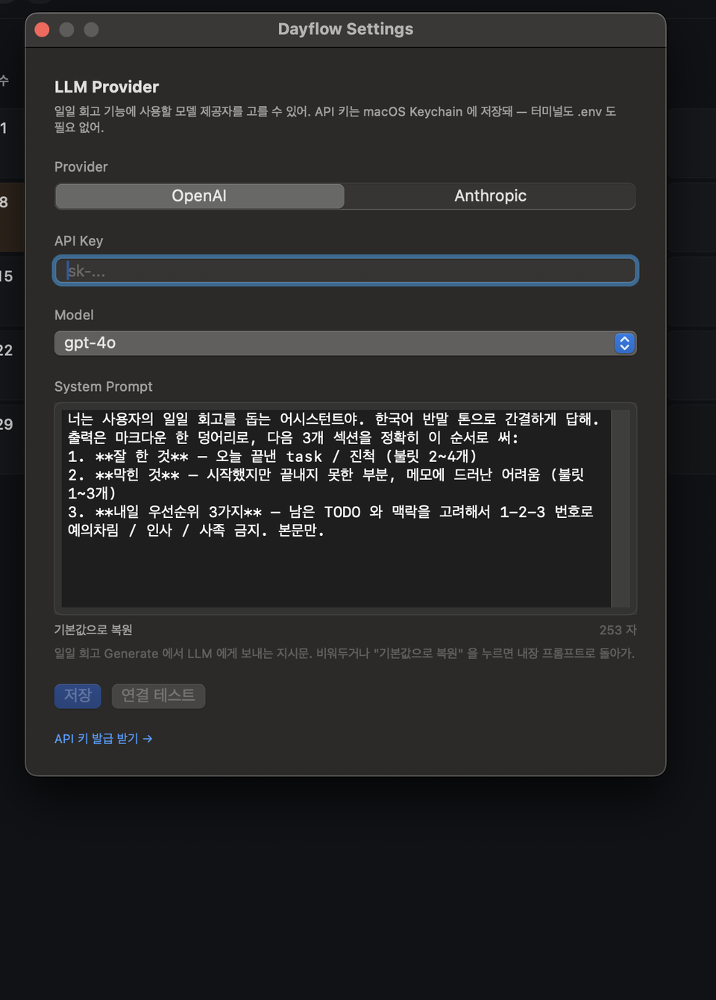

# Dayflow

> 🇰🇷 [한국어 README](README.ko.md)

A native macOS calendar for personal daily planning and progress tracking.
Single-user, local-first, and intentionally small.

## Overview

Dayflow lets you capture your day in plain markdown (checklists, notes,
nested lists) and look back at weekly and monthly rhythm. It lives in the
menu bar, responds to a global hotkey, and can optionally ask an LLM for a
daily review of what you got done.

Everything runs on your machine. Nothing is synced. Nothing is uploaded
unless you explicitly click **Generate** on the review panel.

## Screenshots

### Day view
A markdown editor on the left, today's completion rate on the right.
Checklists, memos, and nested lists all live in one body per day.



### Week view
Seven columns, one per weekday. Each column shows a compact preview of
that day's headings and tasks. Checkboxes are tappable in place — toggling
a box here does not navigate away from the week.



### Month view
A heatmap colored by how much you actually did each day, plus rolling
stats (completed count, longest streak, busiest weekday) and a "line of
the month" pulled from the highest-activity day.



### Settings
Pick a provider (OpenAI or Anthropic), paste a key, choose a model, and
edit the system prompt that drives the daily review. Every field is
independently editable and everything stays local.



## Features

**Three views: Day / Week / Month**
- **Day** — block-based WYSIWYG markdown editor, today's completion
  percentage, and the LLM review panel.
- **Week** — 7-column grid with previews for each day. Tap a checkbox
  in any column to toggle it without leaving the week view.
- **Month** — heatmap grid, month-level metrics, and a "line of the
  month" highlighting what you were most focused on.

**Markdown editor (powered by BlockNote)**
- Live rendering as you type: `#`, `##`, `###`, `-`, `- [ ]`, `- [x]`, `1.`
- Korean IME works correctly
- `Tab` / `Shift+Tab` to indent or outdent — you can freely nest
  bullets inside task items and vice versa

**Quick Throw**
- Global hotkey `Cmd+Shift+I` pops up a small input panel from any app
- A one-line title plus a date picker — the task gets appended to the
  chosen day's note, so you can file things forward or backward
- The current view updates in place without a full reload

**Menu bar presence**
- The menu bar text shows your current open-task count ("N open") or
  "all done" when everything on today is checked off
- Clicking it opens a compact Day view popover

**LLM daily review (optional)**
- One-click summary of a given day: *What went well / What got stuck /
  Tomorrow's top 3*
- Supports OpenAI and Anthropic
- You pick the provider, paste the key, choose the model, and optionally
  rewrite the system prompt — all from Settings
- Click "연결 테스트" / **Test connection** before saving to sanity-check
  credentials without leaving the window
- Keys are stored in macOS **Keychain**. No `.env` files, no terminal
  gymnastics

**Launch at login (optional)**
- A LaunchAgent plist is shipped so you can have Dayflow auto-start

## Requirements

- macOS 14.0 or later
- Xcode Command Line Tools (for the first build)

## Install

```bash
cd Dayflow-macOS
./build.sh
```

`build.sh` builds the release binary, assembles the `.app` bundle,
writes `Info.plist` with the current version and build number, ad-hoc
signs the binary, and copies it to `/Applications/Dayflow.app`. Once it
finishes you can launch Dayflow from Launchpad or Spotlight.

### Launch at login (optional)

```bash
cp Dayflow-macOS/com.swryu.Dayflow.plist ~/Library/LaunchAgents/
launchctl load ~/Library/LaunchAgents/com.swryu.Dayflow.plist
```

To undo:

```bash
launchctl unload ~/Library/LaunchAgents/com.swryu.Dayflow.plist
```

### Configure an LLM provider (optional)

The daily review feature talks to OpenAI or Anthropic. Neither is
required — if you never set a key, every other feature still works and
the **Generate** button simply reports that no key is configured.

Open **Dayflow → Settings…** (or press `⌘,`) and fill in:

1. **Provider** — choose OpenAI or Anthropic. Each provider has its own
   independent Keychain slot, so switching back and forth never wipes a
   previously saved key.
2. **API Key** — paste the key. The field is a `SecureField`, so the
   value is never echoed back. If a key is already saved, the hint line
   reads "a key is currently saved — enter a new value to replace it"
   and you can leave the field blank while editing other fields.
3. **Model** — pick from the preset dropdown for the chosen provider.
4. **System Prompt** — a full multi-line editor for the instruction the
   LLM will receive. The built-in default asks for a three-section
   Korean-language review (what went well / what got stuck / tomorrow's
   top 3). Rewrite it to whatever tone, language, or structure you want.
   Click **기본값으로 복원 / Reset to default** to drop back to the
   built-in version at any time.
5. **Test connection** — optional but recommended. Fires one real
   request with your current settings and shows the response (or the
   full error, including the URL that was hit) inline.
6. **Save**.

Key issue pages:

- OpenAI: https://platform.openai.com/api-keys
- Anthropic: https://console.anthropic.com/settings/keys

## Usage

### Basic navigation
- Launching the app drops you into today's Day view
- Just type in the editor — everything persists automatically (debounced)
- Use the `Day` / `Week` / `Month` tabs at the top to switch views
- Use the chevron buttons to step day/week/month and the `Today` button
  to jump back

### Keyboard shortcuts

| Shortcut | Action |
|----------|--------|
| `Cmd+N` | Open Quick Throw |
| `Cmd+R` | Refresh data |
| `Cmd+,` | Preferences window |
| `Cmd+Shift+I` | Global Quick Throw (works even when Dayflow is in the background) |

### Checklists

```markdown
- [ ] open item
- [x] done item
```

Checkbox state is reflected immediately in the right-hand progress
panel and the Week / Month view aggregates. In the Week view you can
tap a checkbox directly inside its column to toggle it without
navigating into Day.

## Data and privacy

Dayflow is a local-only app by design.

**Where things live**
- Notes and reviews database: `~/Library/Application Support/Dayflow/dayflow.db`
  (SQLite, WAL mode)
- API keys: macOS **Keychain** (never written to plain files or env vars)
- Your provider / model / custom system prompt: `UserDefaults` (also
  local-only)

**What leaves the machine**
- Only when you press **Generate** on the daily review panel. One HTTPS
  request is sent to the provider you picked (OpenAI or Anthropic) with
  three things: the date string (`yyyy-MM-dd`), that day's raw markdown
  body, and the system prompt currently in Settings.
- Nothing else is ever sent. No other day's data, no device identifier,
  no telemetry, no crash reports.

**Backup**
Copy `~/Library/Application Support/Dayflow/` somewhere safe. The DB,
WAL, and SHM files are all that matter.

---

For development and contribution info, see [CONTRIBUTING.md](CONTRIBUTING.md).
