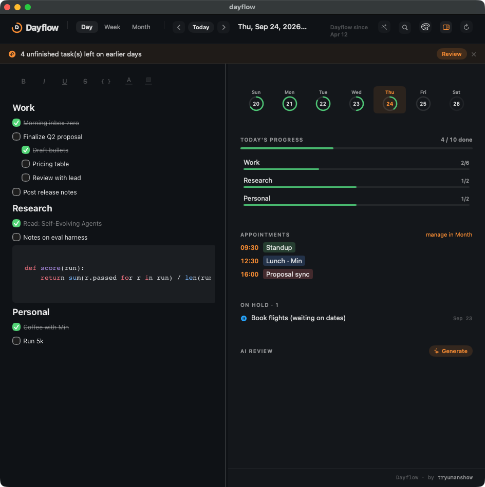
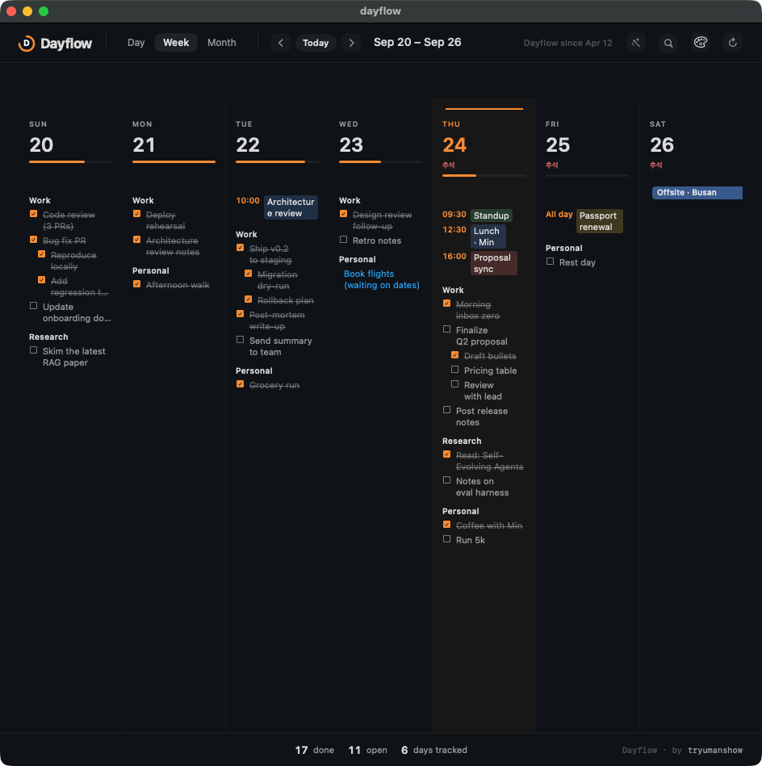
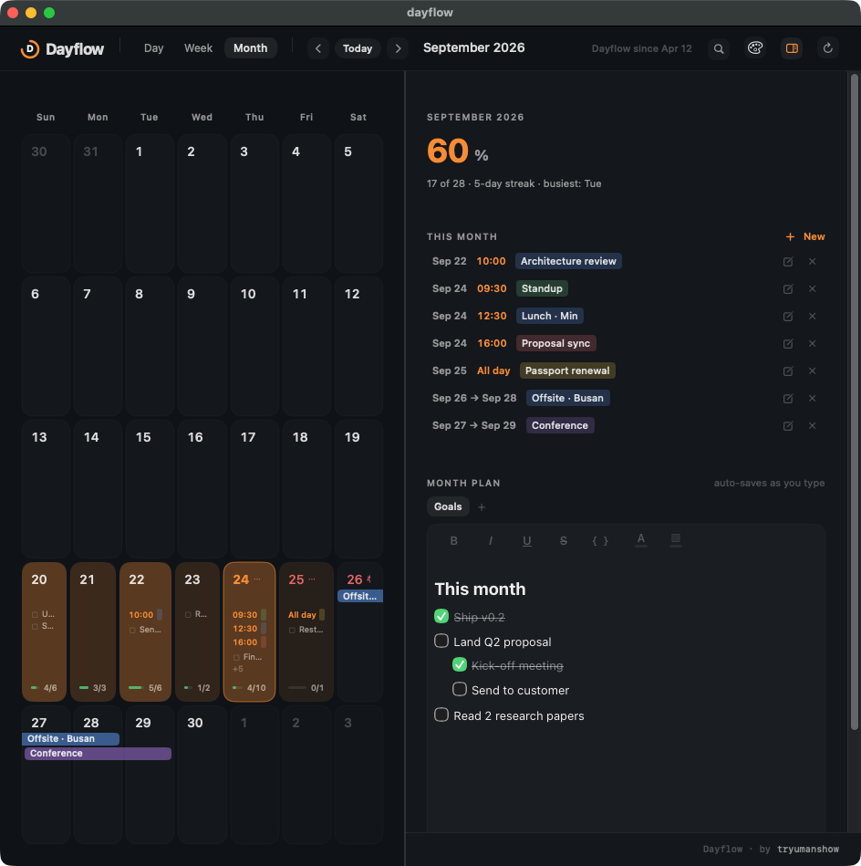
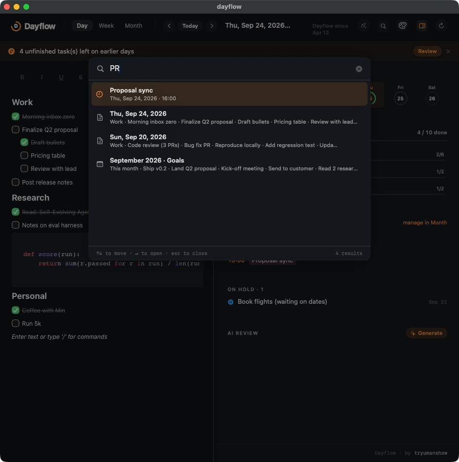
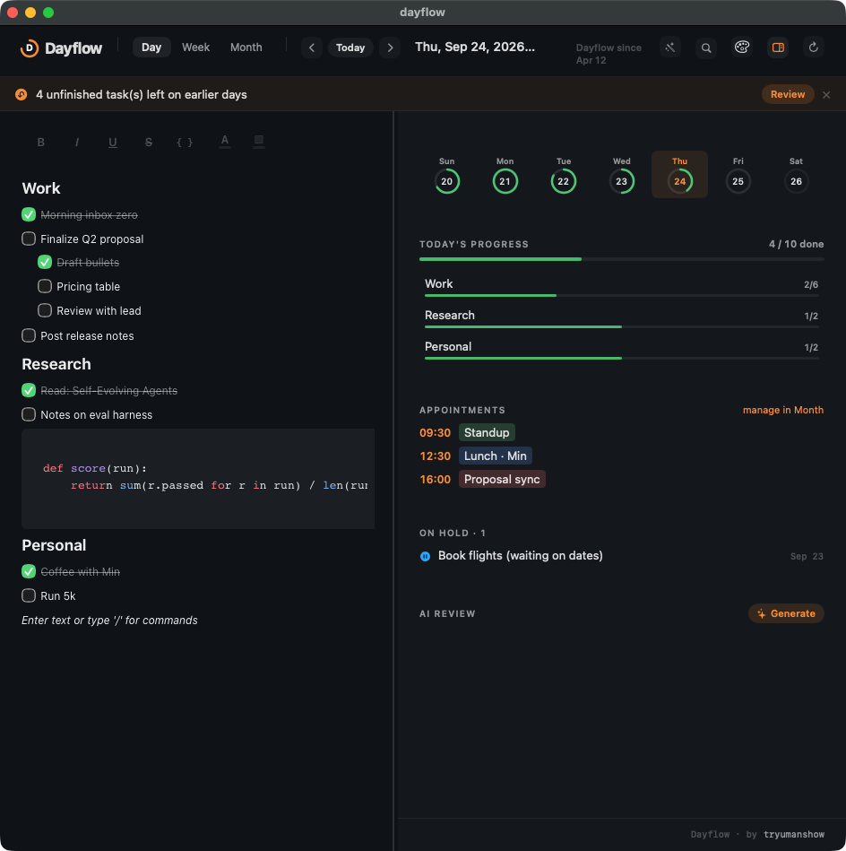
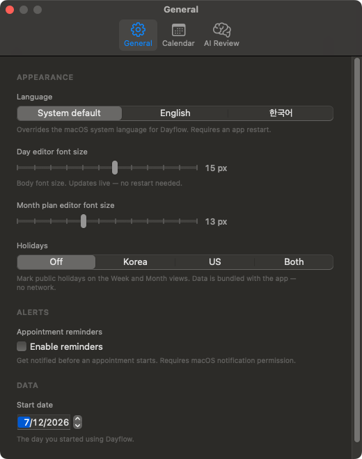

# Dayflow

> 🇰🇷 [한국어 README](README.ko.md)

- A native macOS calendar for personal daily planning and progress tracking.
- Single-user, local-first, intentionally small.
- Lives in the menu bar, responds to a global hotkey, and can optionally ask an LLM to write a daily review.

## Why this exists

Obsidian is where my work lives — project notes, references, anything that has to outlast the current job. What it was never good at, for me, is the other half of the day: what am I actually doing today, what did I leave unfinished last week, when is that appointment. Dayflow is that half. I wrote it for myself, and I open it every morning.

## What you get

- **Three views** — Day / Week / Month, all backed by one markdown body per day.
- **Block-based WYSIWYG editor** — powered by BlockNote, with live rendering of headings, bullets, and checklists.
- **Rich text styling** — bold, italic, underline, strikethrough, inline code, plus text and background color from a top toolbar. Full fidelity is stored alongside the markdown body so colors and underlines survive across reloads.
- **Code blocks** — type `` ``` `` + Space on an empty line, or pick "Code Block" from the slash menu. Monospaced, dark-themed, with fenced markdown round-tripping.
- **Tables** — pick "Table" from the slash menu and choose dimensions from a Notion-style grid picker (up to 6 × 6). Backspace on an empty cell removes the entire table.
- **Monthly plan** — a separate editor per month for the TODOs that belong to the month as a whole, not to any single day. Shown in the Month view right rail.
- **Appointments** — time-stamped items (meetings, reminders) stored in a dedicated `appointments` table. Surfaced in every view: inline add/delete form in the Day rail, chips above the task preview in Week columns, and a sorted "this month" list in the Month rail. Quick Throw (`⌘⇧I`) has a Task / Appointment tab so you can jot either one without leaving your current app.
- **Images** — paste or drop a picture straight into a note. The bytes are copied into `~/Library/Application Support/Dayflow/attachments/` and the note keeps only a reference, so images survive restarts without bloating the database. Copying an image out of a web page stores the picture itself rather than a link to someone else's server.
- **Global search** (`⌘⇧F`) — one palette over every day note, appointment, and month-plan section. Matching is substring-based, so a Korean query lands mid-word too. `↑`/`↓` to move, `↵` to jump to whichever view the hit lives on.
- **Task carry-over** — whatever you left unchecked in the past week shows up as a banner on today. Review the list, keep what still matters, and those tasks *move*: appended to today and removed from the day they were written on, so nothing is counted twice.
- **Appointment reminders** — opt-in macOS notifications, 0 / 5 / 10 / 30 / 60 minutes before an appointment starts. Off until you turn them on.
- **Google Calendar import** — opt-in, **read-only**. Your events are mirrored into Dayflow's appointments and show up in every view; Dayflow never writes anything back to Google.
- **Local-only by design** — notes and reviews live in `~/Library/Application Support/Dayflow/`, API keys live in macOS Keychain. Nothing leaves the machine unless you ask for it: the only two things that ever talk to a server are the LLM review (when you press Generate) and the Google Calendar import (if you connect it).
- **Optional LLM daily review** — OpenAI or Anthropic, picked and configured entirely inside the app.
- **Bilingual** — English or Korean, switchable in Settings, no relaunch-from-terminal needed.

## Screenshots

### Day view
- Markdown editor on the left, today's completion ratio on the right.
- Checklists, memos, and nested lists all live in one body per day.
- Top toolbar: **B** / *I* / <u>U</u> / ~~S~~ / `{ }`, plus text colour and highlight. Select text, click a button. The colour swatches stay folded behind their two buttons — the underline on each one shows the colour the selection already carries.
- Slash menu (`/` on an empty line): headings, lists, code blocks, tables, and more.



### Week view
- Seven columns, one per weekday.
- Each column previews the **open tasks only**, grouped by their nearest heading (up to 2 headings, 3 tasks each). Done work is summarized in the column header's done/total ratio instead of taking preview slots.
- Checkboxes are tappable in place — toggling a box does not navigate away from the week.



### Month view
- Heatmap colored by how much you actually did each day.
- Right rail: month metrics (completion rate, longest streak, busiest weekday), a **Month plan** editor for month-scoped TODOs, and "Line of the month" surfaced from your highest-activity day.



### Global search (`⌘⇧F`)
- One palette over day notes, appointments, and month-plan sections at once. The icon on each row tells you which is which.
- Substring matching, not word matching — searching `산` finds `부산`. (This is why it uses `LIKE` and not SQLite's FTS5: the `unicode61` tokenizer treats a run of Korean as a single token, so mid-word queries would return nothing.)
- `↑`/`↓` to move, `↵` to open. Opening a hit switches to the view that owns it — Day for a note, Week for an appointment, Month for a plan section — and lands on the right date.



### Task carry-over
- A banner appears on today whenever the past 7 days still hold unchecked tasks.
- The same task left open on several days collapses into one row, and anything already written on today is left out.
- Confirming **moves** the tasks: appended to today's note, deleted from the source day. If a source day changed while the sheet was open, that source is skipped rather than guessed at.



### Settings
- **General** — app language, editor font sizes, public-holiday overlays (Korea / US / both, bundled with the app, no network), appointment reminders and how far ahead they fire, and the date you started using Dayflow.
- **AI Review** — provider (OpenAI or Anthropic), API key, model, and the system prompt that drives the daily review.



## Requirements

- macOS 14.0 or later.

## Quickstart (users)

- Head to the [latest release](https://github.com/tryumanshow/dayflow/releases/latest).
- Download `Dayflow-<version>.zip`.
- Unzip — you get `Dayflow.app`.
- Drag `Dayflow.app` into `/Applications`.
- First launch will show a "cannot verify developer" warning because the release is ad-hoc signed (no paid Apple Developer account yet). Two ways around it:
  - **Finder**: right-click `Dayflow.app` → **Open** → confirm in the dialog. Once, then it's trusted forever.
  - **Terminal**: `xattr -cr /Applications/Dayflow.app` then double-click as usual.
- Launch from Launchpad or Spotlight. That's it — no build step, no Xcode required.

## Build from source (developers)

Only needed if you want to modify the code or test an unreleased commit.

Extra requirement: **Xcode Command Line Tools** (`xcode-select --install`).

```bash
git clone https://github.com/tryumanshow/dayflow
cd dayflow/Dayflow-macOS
./build.sh
```

- Builds the release binary.
- Assembles the `.app` bundle with version and build number injected.
- Renders the app icon from `tools/make_icon.py`.
- Ad-hoc signs and installs to `/Applications/Dayflow.app`.
- CI runs the exact same `build.sh` on a `macos-14` runner for every merge to `main`, so the release zip and your local build produce bit-for-bit the same `.app` (modulo timestamps).

### Quick rebuild & restart (development)

```bash
cd dayflow/Dayflow-macOS && swift build \
  && killall DayflowApp \
  ; cp .build/debug/DayflowApp /Applications/Dayflow.app/Contents/MacOS/DayflowApp \
  && open /Applications/Dayflow.app
```

### Launch at login (optional)

```bash
cp Dayflow-macOS/com.swryu.Dayflow.plist ~/Library/LaunchAgents/
launchctl load ~/Library/LaunchAgents/com.swryu.Dayflow.plist
```

- Undo with `launchctl unload ~/Library/LaunchAgents/com.swryu.Dayflow.plist`.

### Configure an LLM provider (optional)

- Open **Dayflow → Settings…** (or press `⌘,`).
- Pick a **Provider** — OpenAI or Anthropic. Each provider has its own independent Keychain slot.
- Paste an **API Key**. The field is a `SecureField`; if a key is already saved you'll see a hint and can leave the field blank while editing other fields.
- Pick a **Model** from the provider's preset dropdown.
- Optionally rewrite the **System Prompt**. The built-in default asks for a three-section review (what went well / what got stuck / tomorrow's top 3). Hit **Reset to default** to go back.
- Click **Test connection** to fire a real request with the current settings. Any error (URL, status code, body snippet) is surfaced inline.
- Click **Save**.

Key issue pages:
- OpenAI: https://platform.openai.com/api-keys
- Anthropic: https://console.anthropic.com/settings/keys

### Switch language

- Settings → **Language**.
- Options: **System default**, **English**, **한국어**.
- Requires a relaunch of Dayflow for the override to take effect.

## Usage

### Basic navigation
- Launching the app drops you into today's Day view.
- Type directly in the editor — everything persists automatically (debounced).
- Switch views via the `Day` / `Week` / `Month` tabs at the top.
- Step through dates with the chevron buttons; jump back to the current day with `Today`.

### Keyboard shortcuts

| Shortcut | Action |
|----------|--------|
| `Cmd+N` | Open Quick Throw |
| `Cmd+Shift+F` | Search all notes, appointments, and month plans |
| `Cmd+R` | Refresh data |
| `Cmd+,` | Preferences window |
| `Cmd+Shift+I` | Global Quick Throw (works even when Dayflow is in the background) |

### Checklists

```markdown
- [ ] open item
- [x] done item
```

- Checkbox state is reflected immediately in the right-hand progress panel and the Week / Month view aggregates.
- In the Week view, tap a checkbox directly inside its column to toggle without navigating into the Day view.

### Appointment reminders

- Settings → **General** → **Enable reminders**. macOS will ask for notification permission the first time.
- Pick how far ahead you want to be told: at start time, or 5 / 10 / 30 / 60 minutes before.
- Reminders are rescheduled from scratch whenever your appointments change, so edits and deletions take effect immediately.
- macOS only keeps a bounded number of pending local notifications, so Dayflow schedules the soonest 60 upcoming appointments and refills as they fire.
- All-day events get no reminder — their midnight start is a storage detail, not a time anything actually happens.

### Google Calendar (optional, read-only)

Import only. Dayflow reads your calendar and never writes to it — imported events can't be edited or deleted inside the app, because the next sync would put them straight back.

**You bring your own OAuth client.** Dayflow ships no Google credentials: an OAuth client id can't be kept secret inside an open-source binary (anyone can pull it out with `strings`), and the API quota and consent screen belong to whoever owns the client. So it's the same shape as the LLM API key — your credentials, your Keychain.

1. In [Google Cloud Console](https://console.cloud.google.com/apis/credentials), create a project.
2. **APIs & Services** → enable the **Google Calendar API**.
3. **Credentials** → **Create credentials** → **OAuth client ID** → application type **Desktop app**.
4. Copy the **Client ID** and **Client secret** into Dayflow: Settings → **Calendar**.
5. Click **Connect Google Calendar**. Your browser opens Google's consent screen; approve it and the tab tells you to come back.

No web server, no domain, and **no nginx** are involved. Google's installed-app flow lets a desktop client redirect to `http://127.0.0.1` on any port, so Dayflow opens a socket for the few seconds the consent screen is up, reads the authorization code off the single request the browser makes to it, and closes. The exchange is protected with PKCE, and the refresh token goes into the macOS Keychain.

After connecting:

- Tick which calendars to mirror. Nothing ticked means your primary calendar only.
- Dayflow syncs on launch, every 30 minutes, and whenever you press **Sync now**.
- The window it mirrors is 30 days back to 180 days ahead.
- Mirrored rows are marked with a small **ⓖ** and carry no edit or delete buttons.
- **Disconnect** forgets the grant and removes every mirrored event. Appointments you typed yourself are untouched.
- Requested scope: `calendar.readonly` — Google will not grant Dayflow write access even if something asked for it.

## Data and privacy

- **Database** — `~/Library/Application Support/Dayflow/dayflow.db` (SQLite, WAL mode). Tables: `day_notes`, `reviews`, `appointments`, and `month_plan_sections` (plus its edit history). Everything a day note contains rides inside the markdown body.
- **API keys and the Google refresh token** — macOS **Keychain**. Never written to plain files, environment variables, or logs.
- **Provider / model / custom system prompt / language override / reminder preferences / Google client id** — `UserDefaults` (also local-only).
- **Outbound traffic** — exactly two things reach the network, and only if you turn them on:
  - **LLM review**, when you press **Generate**. One HTTPS request per press, to the provider you picked. Body contains: the date string (`yyyy-MM-dd`), that day's raw markdown, and the current system prompt.
  - **Google Calendar**, if you connect it. Dayflow *reads* your events over `calendar.readonly`. Your notes are never part of that request — it's a download, not an upload.
- No other day's data, no device identifier, no telemetry, no crash reports — ever.
- **Backup** — copy `~/Library/Application Support/Dayflow/` somewhere safe. The DB plus its WAL and SHM files are all that matter.

---

- Development and contribution info: [CONTRIBUTING.md](CONTRIBUTING.md).
